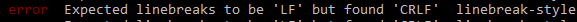
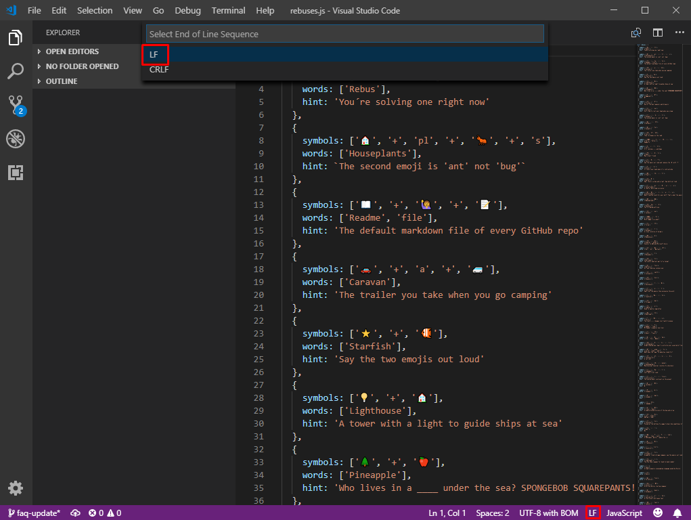

# Rebus

[](https://github.com/ellerbrock/open-source-badges/)
[](https://travis-ci.org/ollelauribostrom/rebus)
[](https://coveralls.io/github/ollelauribostrom/rebus?branch=master)
[](https://gitter.im/rebus-contributors/Lobby)
[](https://www.firsttimersonly.com/)

#### _Lee esto en otro idioma._

<kbd>[](README.md)</kbd>

Contribuir a un proyecto de código abierto por primera vez puede ser algo aterrador. El objetivo de esta repo es ayudarte a dar el primer paso como contribuidor desarrollando una simple (pero potencialmente divertido) juego de jeroglificos juntos. 💖

#### Prueba una version en directo de este juego: https://ollelauribostrom.github.io/rebus/

## ¿Quién puede contribuir?

¡Todos pueden contribuir! (y me refiero a todos) 💫

💻 **No necesitas contribuir con código**. Agrega un nuevo jeroglifico, corrige un error de ortografía, reporta un error, agrega algo de documentación, haz algún rediseño o agrega una traducción. Este proyecto así como la mayoŕía de proyectos de código abierto necesitan todo tipo de contribuciones. No solamente código.

🌟 **Eres suficientemente bueno**. Comienza con algo fácil haciendo algo pequeño (como agregar un nuevo jeroglifico). Esto te ayudará a encaminarte en el proyecto y aumentar tu confianza y experiencia. Nadie te juzgará si haces algo mal, ¡y tú no puedes romper nada! Pide algunos consejos si te quedas atascado. ¡Tú puedes!

➡️ Echa un vistazo a los [open issues](https://github.com/ollelauribostrom/rebus/issues) para ver los pendientes de este proyecto.

Lo único que necesitas para poder comenzar es git. Asegurate que lo tienes instalado en tu computadora corriendo `git --version` en tu terminal. Si aún no tienes instalado git, [instalalo](https://help.github.com/articles/set-up-git/). 

Si tú eres un desarollador experimentado, echa un vistazo al [CONTRIBUTING file](https://github.com/ollelauribostrom/rebus/blob/master/.github/CONTRIBUTING.md) para ver como puedes contribuir.

## ¿Por qué debería contribuir a un proyecto de código abierto?

Cuando tú contribuyes a un proyecto de Código Abierto, ¡tú estás formando parte del esfuerzo colaborativo de una vasta comunidad de apasionados desarrolladores y contribuidores! El software de Código Abierto te permite ver, usar, y aún más importante modificar su propio código. Contribuir al Código Abierto es una increíble manera de desarrollar más profundamente los conocimientos de software, y la mejor parte es ser cápaz de aprender y enseñar junto a una comunidad de colaboradores.

## ¿Cómo puedo contribuir?

Sigue la siguiente guía paso a paso para hacer tu primera contribución de código abierto. Los pasos que ejecutes en esta guía es un flujo de trabajo algo estándar que encontrarás en la mayoría de los proyectos: `Bifurcar -> Clonar -> Instalar dependencias -> Hacer los cambios -> Hacer un testeo -> Enviar -> Solicitud de cambios`

### 1. Bifurcación

El primer paso es crear una bifurcación de este repositorio. Haciendo click en el botón de fork en la esquina superior de esta página. Una bifurcación es básicamente tu propia copia de trabajo de este repositorio.


## 2. Clonar

El siguiente paso es clonar el repositorio bifurcado en tu maquina.

Ve a tus repositorios de Github y abre el repositorio bifurcado llamado Rebus (_bifurcado desde ollelauribostrom/rebus_). Haz click en  en el botón "Descargar clon" y después haz click en el icono de copiar al portapapeles para obtener el enlace.


Finalmente corre el siguiente comando de git en tu terminal:

```sh
git clone "the copied url"
```

Por ejemplo:

```
git clone https://github.com/username/rebus.git
```

### 3. Registra el upstream repository

Ahora tienes un clon local en tu computadora. Este clon apunta a tu repositorio bifurcado. Es también útil tener el upstream repository (la código que has bifurcado) registrado también para poder estar al día con los últimos cambios.

Si no lo has hecho ya, comienza dirigiendote al tu directorio del repositorio rebus que fue creado cuando corriste `git clone`:

```sh
cd rebus
```

Entonces agrega `ollelauribostrom/rebus` como el upstream remoto:

```
git remote add upstream https://github.com/ollelauribostrom/rebus.git
```

### 4. Crea una rama

Es una practica común crear una nueva rama para cada mejora o corrección de error en la qué estés trabajando en este momento. ¡Vamos a crear una!

Primero, asegurate que tenemos la última versión del repositorio upstream corriendo (haz esto cada vez que crees una nueva rama):

```sh
git fetch upstream
```

Crea una nueva rama corriendo el comando:

```sh
git checkout -b <el-nombre-de-tu-nueva-rama> upstream/master
```
> Nota: Remplaza `<el-nombre-de-tu-nueva-rama>` con algo que describa los cambios que estás haciendo.

Por ejemplo:

```sh
git checkout -b agregar-nuevo-jeroglifico upstream/master
```

> Nota: Especificando `upstream/master` estamos diciendo que nuestra nueva rama debe crearse a partir de la última versión upstream.

### 5. Instalar las dependencias

Antes de comenzar a hacer nuestros cambios, instalemos las dependencias de los proyectos.

```sh
npm install
```

### 6. Haz tus cambios

Es hora de hacer tus cambios. Vamos a agregar un nuevo jeroglifico al juego.

1. Abre el archivo `src/js/rebuses.js` en tu editor favorito (recomendamos VSCode 😉).

1. Agrega un nuevo objeto rebus al final del arreglo `rebuses`.
1. Guarda el archivo cuando lo hayas hecho.

### 7. Corre el juego localmente

Si tú lo deseas, puedes correr el juego localmente para probar tus cambios:

```sh
npm start
```
### 8. Corre las pruebas

Antes de confirmar tus cambios, corre tus pruebas para asegurarte que no rompiste nada:

```sh
npm run test:all
```

### 9. Confirma tus cambios

Corre `git status` para ver que cambios tú haz hecho. Eso se verá a algo como esto:


Agrega esos cambios a tu siguiente confirmación corriendo:

```sh
git add src/js/rebuses.js
```

Y confirmalo corriendo:

```sh
git commit -m "Tu mensaje"
```

Por ejemplo: 

```sh
git commit -m "Agregando un nuevo jeroglifico"
```

### 10. Envia tus cambios a Github

Envía tus cambios a GitHub corriendo:

```sh
git push origin <el-nombre-de-tu-nueva-rama>
```

> Nota: Remplaza `<el-nombre-de-tu-nueva-rama>` con el nombre de tu rama

### 11. Abre un Pull Request

Dirígite a tu repositorio en Github y haz click en el botón verde de "Compare and pull request".


Describe tus cambios y envía tu pull request


## ¿Qué sigue?

🎉 Felicidades 🎉

Acabas de dar el primer paso como contribuidor de código abierto. Tu pull request será examinada tan pronto como sea posible.
Unete a nuestra [Sala de chat](https://gitter.im/rebus-contributors/Lobby) si tienes alguna duda o necesitas alguna ayuda. Si gustas, por favor dale a este repositorio una estrella ⭐.

Si tú quieres algo más en lo que trabajar, echa un vistazo a los [the open issues](https://github.com/ollelauribostrom/rebus/issues) para inspiración. También, echa un vistazo a la sección de [Otras lecturas](https://github.com/ollelauribostrom/rebus#further-reading) para más asombrosas fuentes de aprendizaje.

## Preguntas Frecuentes

### Resolver Conflictos de Unión ###

Una vez que los cambios se han confirmado y organizado, es hora de gestionar los conlifcots ejecutando:

```sh
git pull upstream master
```

Regresa a tu editor de código favorito y revisa cualquier conflicto. Generalmente cambios `actuales` estarán resaltados en un color y `próximos` cambios estarán resaltados en un diferente color. `Acepta` los cambios `Actuales` o `Proximos` cambios.

Confirma los cambios de nuevo como se describe en los pasos #9 y #10 anteriores o corriendo:

```sh
git add -A
```
```sh
git commit -m "Tu mensaje"
```

```sh
git push origin <el-nombre-de-tu-nueva-rama>
```

### Saltos de línea ###

Es importante que observes que los sistemas operativos Windows y Linux tratan con finales de linea diferentes. Si tú estás teniendo un eror mientras el programa espera un salto de línea sea "lf" pero encuentras el estilo de salto de línea "crlf".



así que corre el siguiente comando en tu terminal:

```sh
npm run lint -- --fix 
```

Para evitar este roblema en el futuro, puedes cambiar en su editor de texto para usar una secuencia de línea de "lf". Para hacer esto en Visual Studio Code, simplemente haz click en el botón lf/crlf en la esquina inferior derecha y entonces selecciona 'lf' desde el menú desplegable que acaba de aparecer.

 

## Más Lecturas (en inglés)

- [Guía de Github Código Abierto](https://opensource.guide/)
- [Recursos para aprender Git](https://try.github.io/)
- [Tutorial de Git Parte 1: ¿Qué es un Control de Versiones?](https://www.youtube.com/watch?v=9GKpbI1siow&feature=youtu.be)
- [Tutorial de Git Parte 2: Vocabulario (Repo, Staging, Commit, Push, Pull)](https://www.youtube.com/watch?v=n-p1RUmdl9M)
- [Tutorial de Git Parte 3: Instalación, Línea de Comandos y Clonar](https://www.youtube.com/watch?v=UFEby2zo-9E)
- [Tutorial de Git Parte 4: GitHub (Enviando a un servidor)](https://www.youtube.com/watch?v=ol_UCWox9kc)
- [Git y GitHub Curso Intensivo para Principiantes](https://www.youtube.com/watch?v=SWYqp7iY_Tc)
- [Magia Git](http://www-cs-students.stanford.edu/~blynn/gitmagic/index.html)
- [Repositorios Amigables para Principiantes](https://github.com/MunGell/awesome-for-beginners)
- [Repositorios GitHub  Aprobados por Contribuidores para Principiantes](https://github.com/showcases/great-for-new-contributors)
- [Sourcetree - Interfaz Gráfica de Git para MacOs y Windows](https://www.sourcetreeapp.com/)
- [VS Code - editor de código ampliable](https://code.visualstudio.com/)
- [GitHub Atom - Un Editor de Texto Hackeable para este Siglo 21](https://atom.io/)

## Soporte

Por favor [Abre una issue](https://github.com/ollelauribostrom/rebus/issues/new) para soporte, o unete a nuestra [Sala de chat](https://gitter.im/rebus-contributors/Lobby).

## Código de conducta

Este proyecto de adhiere al [Fundación de Código de Conducta JS](https://js.foundation/community/code-of-conduct).
Por favor lee completamente para que puedas entender qué acciones serán o no toleradas

## License

Licenciada para la Licencia MIT.


