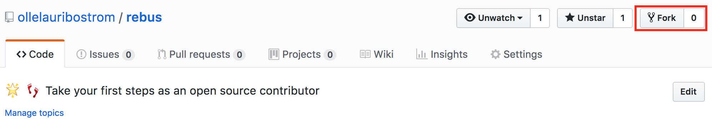
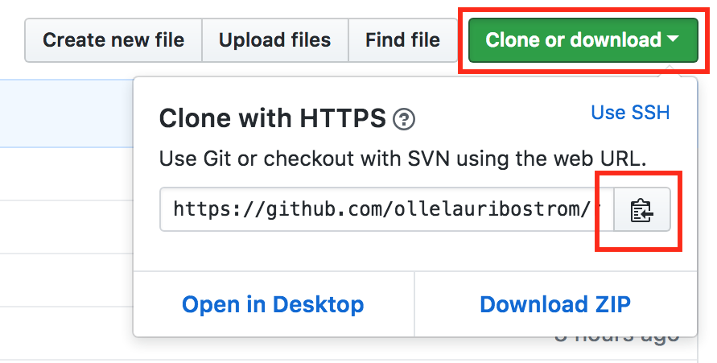
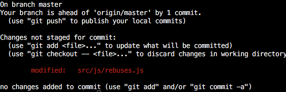
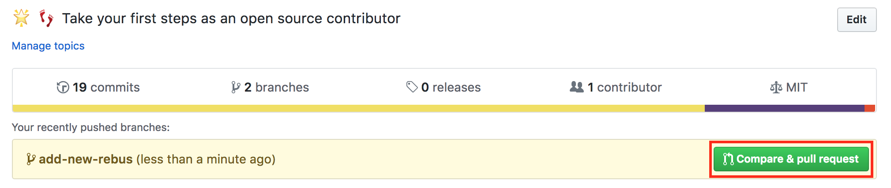
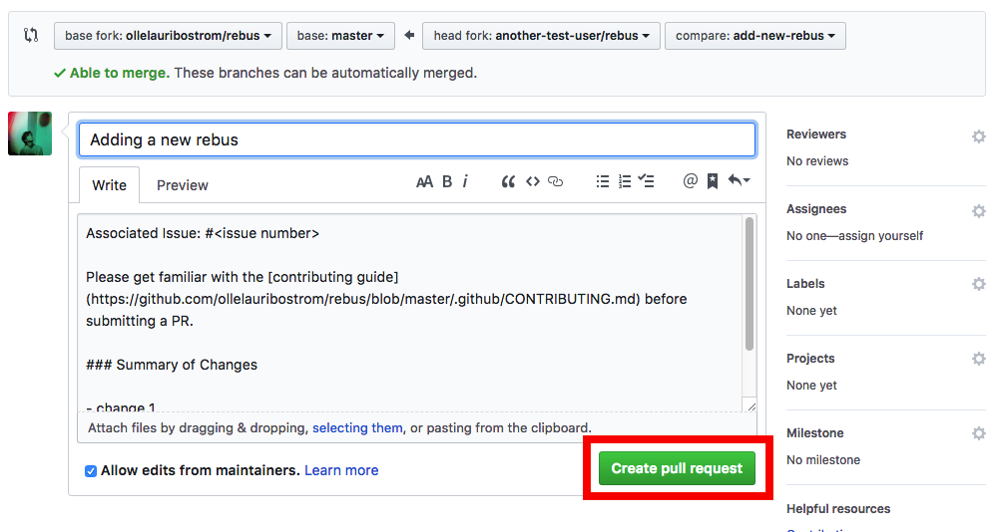

# Rebus

[](https://github.com/ellerbrock/open-source-badges/)
[](https://travis-ci.org/ollelauribostrom/rebus)
[](https://coveralls.io/github/ollelauribostrom/rebus?branch=master)
[](https://gitter.im/rebus-contributors/Lobby)

Contributing to an open source project for the first time can be a scary thing. The goal of this repo is to help you take your first steps as an open source contributor by developing a simple (but hopefully fun) rebus game together. 💖

#### Try the live version of the game: https://ollelauribostrom.github.io/rebus/

## Who can contribute?

Everyone can! (and I mean everyone) 💫

💻 **You don’t have to contribute code**. Add a new rebus, fix a typo, report a bug, add some documentation, do some re-design or add a translation. This project just like most open source projects are in need of all sorts of different contributions. Not just code.

🌟 **You are good enough**. Start of easy by fixing something small (like adding a new rebus). This will help you orientate yourself in the project and increase your confidence and experience. No one will judge you if you make a mistake and you can't break anything. Ask for some pointers if you get stuck. You got this!

➡️ Have a look at the [open issues](https://github.com/ollelauribostrom/rebus/issues) to see what needs to be done in this project.

The only thing that is required to get started is git. Make sure you have it installed on your computer by running `git --version` in your terminal. If you do not have git installed, [install it](https://help.github.com/articles/set-up-git/).

If you are an experienced developer, look at the [CONTRIBUTING file](https://github.com/ollelauribostrom/rebus/blob/master/.github/CONTRIBUTING.md) to see how you can contribute.

## Fork this repo

The first step is to create a fork of this repo. Do so by clicking on the fork button on the top of this page. A fork is basically your own working copy of this repository.



## Clone the repo

The next step is to clone the forked repo to your machine.

Go to your GitHub repositories and open the forked repository called Rebus (_forked from ollelauribostrom/rebus_). Then click on the "Clone or download" button and then click the copy to clipboard icon to get your url.



Finally run the following git command in your terminal:

```sh
git clone "the copied url"
```

For example:

```
git clone https://github.com/username/rebus.git
```

## Register the upstream repository

You have now created a local clone on you computer. This clone will point to your forked repository. It's also useful to have
the upstream repository (the source that your forked) registered as well to be able to stay up to date with the latest changes.

If you haven't already, start by changing your directory to the rebus catalog that was created when you ran `git clone`:

```sh
cd rebus
```

Then add `ollelauribostrom/rebus` as the upstream remote:

```
git remote add upstream https://github.com/ollelauribostrom/rebus.git
```

## Create a branch

It's common practice to create a new branch for each new feature of bugfix you are working on. Let's go ahead and create one.

First, lets make sure we got the latest version of the upstream repository by running (do this before each time you create a new branch):

```sh
git fetch upstream
```

Create your new branch by running:

```sh
git checkout -b <your-new-branch-name> upstream/master
```

> Note: Replace `<your-new-branch-name>` with something that describes the changes you are about to make

For example:

```sh
git checkout -b add-new-rebus upstream/master
```

> Note: By specifying `upstream/master` we're saying that our new branch should be created from the latest upstream version

## Installing the dependencies

Before we begin making our changes, let's install the projects dependencies:

```sh
npm install
```

## Make your changes

Now it's time to make your changes. Let's add a new rebus to the game.

1. Open the file `src/js/rebuses.js` in your favourite editor (preferable VSCode 😉).
1. Add a new rebus object to the end of the `rebuses` array.
1. Save the file when you are done.

## Running the game locally

If you want, you can run the game locally to try out your changes:

```sh
npm start
```

## Running the tests

Before your commit your changes, run the tests to make sure you did'nt break anything:

```sh
npm run test:all
```

## Committing your changes

Run `git status` to see which changes you have made. This will look something like:



Add these changes to your next commit by running:

```sh
git add src/js/rebuses.js
```

And then commit them by running:

```sh
git commit -m "Your message"
```

For example:

```sh
git commit -m "Adding a new rebus"
```

## Push your changes to Github

Push your changes to GitHub by running:

```sh
git push origin <your-new-branch-name>
```

> Note: Replace `<your-new-branch-name>` with the name of your branch

## Open a Pull Request

Head over to your repository on GitHub and click on the green "Compare and pull request" button.



Describe your changes and submit your pull request



## What's next?

🎉 Congratulations 🎉

You just took your first step as an open source contributor. Your pull request will be reviewed as soon as possible.
Join us on [gitter](https://gitter.im/rebus-contributors/Lobby) if you have questions or need any help. If you feel like
it, please give this repository a star ⭐.

If you want something more to work on, look at [the open issues](https://github.com/ollelauribostrom/rebus/issues) for
inspiration. Also, take a look the [Further Reading](https://github.com/ollelauribostrom/rebus#further-reading) section for more great learning resources.

## Further Reading

- [GitHub Open Source Guide](https://opensource.guide/)
- [Resource To learn Git](https://try.github.io/)
- [Git Tutorial Part 1: What is Version Control?](https://www.youtube.com/watch?v=9GKpbI1siow&feature=youtu.be)
- [Git Tutorial Part 2: Vocab (Repo, Staging, Commit, Push, Pull)](https://www.youtube.com/watch?v=n-p1RUmdl9M)
- [Git Tutorial Part 3: Installation, Command-line & Clone](https://www.youtube.com/watch?v=UFEby2zo-9E)
- [Git Tutorial Part 4: GitHub (Pushing to a Server)](https://www.youtube.com/watch?v=ol_UCWox9kc)
- [Git & GitHub Crash Course For Beginners](https://www.youtube.com/watch?v=SWYqp7iY_Tc)

## Support

Please [open an issue](https://github.com/ollelauribostrom/rebus/issues/new) for support, or join us on [gitter](https://gitter.im/rebus-contributors/Lobby).

## Code of Conduct

This project adheres to the [JS Foundation Code of Conduct](https://js.foundation/community/code-of-conduct).
Please read the full text so that you can understand what actions will and will not be tolerated.


## License

Licensed under the MIT License.
